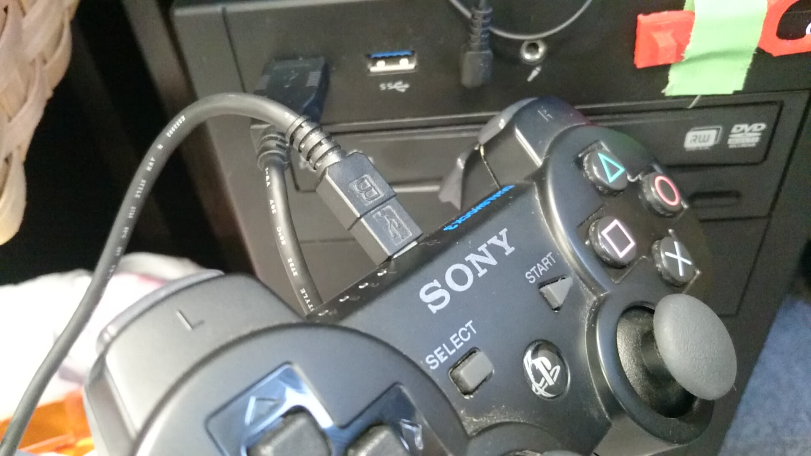

# ros_joy_tutorial

* rosでjoyスティック(PS3コントローラ)を使うための方法
* rosの[チュートリアル](http://wiki.ros.org/joy/Tutorials/ConfiguringALinuxJoystick)の日本語訳

##1.1 インストール
まず、パッケージをインストールする

```bash
$ sudo apt-get install ros-indigo-joy
```

##1.2 Joyスティックの接続確認

このようにPCと接続し、以下のコマンドを実行する。
```bash
$ ls /dev/input/

by-id    event10  event14  event2  event6  js0
by-path  event11  event15  event3  event7  mice
event0   event12  event16  event4  event8  mouse0
event1   event13  event17  event5  event9
```
端末には上記のような表示が出てくる。`jsX`がjoysticが接続されていることを示している。ここでは`js0`として認識されている。

joysticの動作を確認する。
```bash
$ sudo jstest /dev/input/js0

Driver version is 2.1.0.
Joystick (Sony PLAYSTATION(R)3 Controller) has 27 axes (X, Y, Z, Rz, (null), (null), (null), (null), (null), (null), (null), (null), (null), (null), (null), (null), (null), (null), (null), (null), (null), (null), (null), (null), (null), (null), (null))
and 19 buttons (Trigger, ThumbBtn, ThumbBtn2, TopBtn, TopBtn2, PinkieBtn, BaseBtn, BaseBtn2, BaseBtn3, BaseBtn4, BaseBtn5, BaseBtn6, BtnDead, BtnA, BtnB, BtnC, (null), (null), (null)).
Testing ... (interrupt to exit)
Axes:  0:     0  1:     0  2:     0  3:     0  4:     0  5:     0  6:     0  7:     0  8:     0  9:     0 10:     0 11:     0 12:     0 13:     0 14:     0 15:     0 16:     0 17:     0 18:     0 19:     0 20:     0 21:     0 22:     0 23:     0 24:     0 25:     0 26:     0 Buttons:  0:off  1:off  2:off  3:off  4:off  5:off  6:off  7:off  8:off  9:off 10:off 11:off 12:off 13:off 14:off 15:off 16:off
...
```
実際にコントローラを動かすと数値が変化しているのことがわかる。

確認ができたら、つづいてROSのjoy nodeでjoysticにアクセスする。
まずは、joystickの権限を一覧表示する。
```bash
$ ls -l /dev/input/js0

crw-rw-XX- 1 root dialout 188, 0 2009-08-14 12:04 /dev/input/jsX
```
上に似たようなものが表示される。ここで、

1. XXがrwの場合、jsデバイスは適切に設定されている。
2. XXが - -の場合、jsデバイスは適切に設定されていない。故に、以下のコマンドを実行する必要がある。
  ```bash
  $ sudo chmod a+rw /dev/input/jsX
  ```

######筆者の場合、
```bash
crw-rw-r--+ 1 root root 13, 0  3月 17 17:09 /dev/input/js0
```
と表示され、XXがrwではなかったため、上記2.のコマンドを実行することで
```bash
crw-rw-rw-+ 1 root root 13, 0  3月 17 17:09 /dev/input/js0
```
rwとなった。


## 1.3 Joy Nodeの起動
ROSでPublishされたjoysticのデータを得るためにjoy nodeを起動する必要がある。まず、joy nodeにjoysticデバイスのjs0を使用することを教える。
```bash
$ rosparam set joy_node/dev "/dev/input/js0"
```
そして、joy nodeを起動する。
```bash
$ rosrun joy joy_node
```
```bash
[ INFO] [1458374529.683367169]: Opened joystick: /dev/input/js0. deadzone_: 0.050000.
```

joysticのデータを見るために、新しいターミナルを開いてrostopic echoする。
```bash
$ rostopic echo joy

---
header: 
  seq: 805
  stamp: 
    secs: 1458374796
    nsecs: 794666707
  frame_id: ''
axes: [0.0, 0.0, 0.0, 0.0, 0.0, 0.0, 0.0, 0.0, 0.0, 0.0, 0.0, 0.0, 0.0, 0.0, 0.0, 0.0, 0.0, 0.0, 0.0, 0.0, 0.0, 0.0, 0.0, 0.0, 0.0, 0.07863013446331024, 0.0]
buttons: [0, 0, 0, 0, 0, 0, 0, 0, 0, 0, 0, 0, 0, 0, 0, 0, 0, 0, 0]
---
...
```
上記のような表示がされる。


